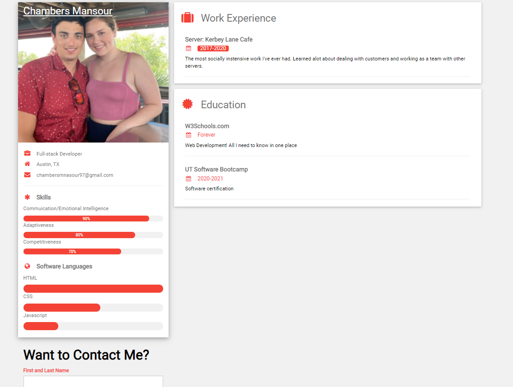
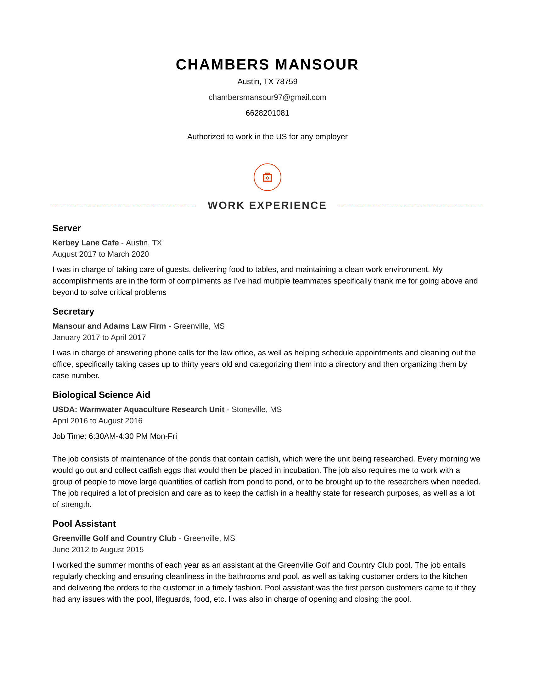

    My Updated Portfoilio

    One of the first things I decided to update from my first portfolio is that I decided to switch
    my CSS framework from bootstrap to W3School's css framework. The main advantage is it's flexible as it allows for 
    more cutomization over Bootstrap. Even though the base documentation they give is less flashy, but it really just take a few extra hours to make up for that. The portfolio can using a little freshening up, but compared to the first attempt at building a portfolio, this one looks beautiful.

